# Sofa Hub — extensive topical cluster map

Corrected Guide → Category → Product architecture for all **12 live products**.  
Includes every step to take (keyword injection + internal linking).

**Live guides today:** `/guides/how-to-measure-for-sofa-delivery-uk` · `/guides/corner-sofa-vs-3-and-2-seater-set` · `/guides/scatter-back-vs-high-back-sofas`  
**Planned guides** (marked *planned*): Chesterfield buying · Fabric/jumbo cord cleaning · Leather care

Machine table: [`topical-map.csv`](topical-map.csv)

---

## Master step-by-step (do this order)

```mermaid
flowchart TD
  START([START — The Sofa Hub UK]) --> P0

  P0["Phase 0 — Approve map<br/>No site edits yet"]
  P0 --> P1

  P1["Phase 1 — MONEY PAGES first<br/>Inject Tier-1 keywords into title · H1 · meta · intro · FAQ"]
  P1 --> P1A["1A Corner hub<br/>/shop/corner-sofas<br/>corner sofa · L-shape · small · leather · cheap corner"]
  P1A --> P1B["1B Colour spokes<br/>/shop/colour/grey-sofas<br/>/shop/colour/cream-sofas<br/>grey / cream / beige corner"]
  P1B --> P1C["1C Size hubs<br/>/shop/size/3-seater<br/>/shop/size/2-seater<br/>/shop/size/armchair"]
  P1C --> P1D["1D Style hubs<br/>/shop/chesterfield-sofas<br/>/shop/u-shape-sofas"]
  P1D --> P1E["1E Sets hub<br/>/shop/3-2-sofa-sets<br/>UK 3 and 2 / 3+2 set language"]
  P1E --> P1F["1F Leather + value<br/>/shop/all + home<br/>leather sofa · COD / free delivery"]
  P1F --> P2

  P2["Phase 2 — PRODUCT pages<br/>Cross-link each product into its cluster hub"]
  P2 --> P2A["2A Corner products<br/>Lily · Dino · Verona · Ashton · Harrison · Malibu · Oakland · Borrius · Atalian · Olympia · Falcon"]
  P2A --> P2B["2B U-shape product<br/>Bishop only → /shop/u-shape-sofas"]
  P2B --> P2C["2C Chesterfield products<br/>Atalian · Olympia · Falcon"]
  P2C --> P2D["2D Sets + Verona styles<br/>3+2 configs · scatter / high back"]
  P2D --> P2E["2E Material heroes<br/>Oakland leather · Dino cord"]
  P2E --> P3

  P3["Phase 3 — TIER 2 strengthen<br/>Modifiers + FAQs on existing pages"]
  P3 --> P3A["3A Corner FAQ: left vs right hand"]
  P3A --> P3B["3B Modular hub → Borrius<br/>/shop/modular-sofas"]
  P3B --> P3C["3C Material modifiers<br/>fabric · chenille · brown/tan/black leather"]
  P3C --> P3D["3D Full-set hub language<br/>/shop/3-2-1-full-sets"]
  P3D --> P4

  P4["Phase 4 — GUIDES + TIER 3<br/>Link guides ↔ categories ↔ products"]
  P4 --> P4A["4A Wire live guides<br/>measure · corner vs 3+2 · scatter vs high back"]
  P4A --> P4B["4B Optional new guides later<br/>Chesterfield buying · fabric cleaning · leather care"]
  P4B --> P4C["4C Doorway / cleaning FAQs on hubs"]
  P4C --> HOLD

  HOLD["NEVER inject unless stocked<br/>Sofa beds · Recliners"]
  HOLD --> DONE([DONE — re-check rankings / Semrush])
```

### Phase checklist

| Phase | Step | Action | URL(s) |
|:-----:|:----:|--------|--------|
| 0 | — | Approve this map | — |
| 1 | 1A | Inject corner keywords | `/shop/corner-sofas` |
| 1 | 1B | Inject colour × corner | `/shop/colour/grey-sofas`, `cream-sofas` |
| 1 | 1C | Inject size keywords | `/shop/size/3-seater`, `2-seater`, `armchair` |
| 1 | 1D | Inject style keywords | `/shop/chesterfield-sofas`, `u-shape-sofas` |
| 1 | 1E | Inject set keywords | `/shop/3-2-sofa-sets` |
| 1 | 1F | Leather + COD USP | `/shop/all`, home |
| 2 | 2A–E | Product internal links into hubs | All 12 product URLs |
| 3 | 3A–D | Tier-2 FAQs / modifiers | Corner, modular, colour, full-set |
| 4 | 4A–C | Guide linking + optional new guides | `/guides/*` |
| — | Hold | Do not target | Sofa beds, recliners |

---

## Full architecture: Guide → Category → Product

*Dashed = guide link (informational). Solid = commercial → transactional.*

```mermaid
flowchart TB
  HUB["THE SOFA HUB UK<br/>thesofahub.co.uk"]

  HUB --> CL1
  HUB --> CL2
  HUB --> CL3
  HUB --> CL4
  HUB --> CL5
  HUB --> CL6
  HUB --> CL7
  HUB --> CL8
  HUB --> CL9

  %% ========== CLUSTER 1 CORNER ==========
  subgraph CL1["Cluster 1 — Corner / L-shape / Room fit"]
    direction TB
    G1["PILLAR GUIDE live<br/>Doorway & Room Sizing<br/>/guides/how-to-measure-for-sofa-delivery-uk<br/>Intent: Informational"]
    G1b["PILLAR GUIDE live<br/>Corner vs 3+2 Set<br/>/guides/corner-sofa-vs-3-and-2-seater-set<br/>Intent: Commercial investigation"]
    CAT1["CATEGORY<br/>Corner Sofas UK<br/>/shop/corner-sofas<br/>Intent: Commercial<br/>KW: corner sofa · L-shape · small · cheap corner"]
    G1 -.-> CAT1
    G1b -.-> CAT1
    CAT1 --> P1a["PRODUCT Lily Corner<br/>/products/lily-sofa/corner"]
    CAT1 --> P1b["PRODUCT Dino Corner<br/>/products/dino-sofa/corner"]
    CAT1 --> P1c["PRODUCT Verona Corner<br/>/products/verona-sofa/*/corner"]
    CAT1 --> P1d["PRODUCT Ashton Corner<br/>/products/ashton-sofa/corner"]
    CAT1 --> P1e["PRODUCT Harrison Corner<br/>/products/harrison-sofa/corner"]
    CAT1 --> P1f["PRODUCT Malibu Corner<br/>/products/malibu-sofa"]
    CAT1 --> P1g["PRODUCT Oakland Corner<br/>/products/oakland-sofa"]
    CAT1 --> P1h["PRODUCT Borrius Corner<br/>/products/sloane-borrius-modular"]
    CAT1 --> P1i["PRODUCT Atalian Corner<br/>/products/atalian-sofa/corner"]
    CAT1 --> P1j["PRODUCT Olympia Corner<br/>/products/olympia-sofa/corner"]
    CAT1 --> P1k["PRODUCT Falcon Corner<br/>/products/falcon-sofa"]
  end

  %% ========== CLUSTER 2 U-SHAPE ==========
  subgraph CL2["Cluster 2 — U-shape / Max seating"]
    direction TB
    G2["PILLAR GUIDE live<br/>Doorway & Room Sizing<br/>same measure guide<br/>Intent: Informational"]
    CAT2["CATEGORY<br/>U-Shape Sofas<br/>/shop/u-shape-sofas<br/>Intent: Commercial<br/>KW: u shaped sofa · u shape sofa"]
    G2 -.-> CAT2
    CAT2 --> P2a["PRODUCT Bishop U-Shape<br/>/products/bishop-u-shape<br/>Intent: Transactional"]
  end

  %% ========== CLUSTER 3 SETS + VERONA ==========
  subgraph CL3["Cluster 3 — 3+2 Sets / Scatter vs High Back"]
    direction TB
    G3["PILLAR GUIDE live<br/>Scatter Back vs High Back<br/>/guides/scatter-back-vs-high-back-sofas<br/>Intent: Commercial investigation"]
    G3b["PILLAR GUIDE live<br/>Corner vs 3+2 Set<br/>/guides/corner-sofa-vs-3-and-2-seater-set"]
    CAT3["CATEGORY<br/>3+2 Sofa Sets<br/>/shop/3-2-sofa-sets<br/>Intent: Commercial<br/>KW: 3 and 2 · sofa 3+2 seater set"]
    CAT3b["CATEGORY<br/>3+2+1 Full Sets<br/>/shop/3-2-1-full-sets<br/>Intent: Commercial"]
    G3 -.-> CAT3
    G3b -.-> CAT3
    CAT3 --> P3a["PRODUCT Verona Scatter 3+2<br/>/products/verona-sofa/scatter-back/3-2-set"]
    CAT3 --> P3b["PRODUCT Verona High Back 3+2<br/>/products/verona-sofa/high-back/3-2-set"]
    CAT3 --> P3c["PRODUCT Harrison 3+2<br/>/products/harrison-sofa/3-2-set"]
    CAT3 --> P3d["PRODUCT Ashton 3+2<br/>/products/ashton-sofa/3-2-set"]
    CAT3 --> P3e["PRODUCT Lily 3+2<br/>/products/lily-sofa/3-2-set"]
    CAT3 --> P3f["PRODUCT Dino 3+2<br/>/products/dino-sofa/3-2-set"]
    CAT3 --> P3g["PRODUCT Atalian 3+2<br/>/products/atalian-sofa/3-2-set"]
    CAT3 --> P3h["PRODUCT Olympia 3+2<br/>/products/olympia-sofa/3-2-set"]
    CAT3 --> P3i["PRODUCT Oakland / Malibu / Falcon 3+2"]
    CAT3 --> CAT3b
  end

  %% ========== CLUSTER 4 CHESTERFIELD ==========
  subgraph CL4["Cluster 4 — Chesterfield heritage"]
    direction TB
    G4["PILLAR GUIDE planned<br/>Chesterfield Buying & Styling<br/>/guides/chesterfield-sofa-buying-guide<br/>Intent: Informational / Commercial"]
    CAT4["CATEGORY<br/>Chesterfield Sofas<br/>/shop/chesterfield-sofas<br/>Intent: Commercial<br/>KW: chesterfield sofa · velvet / leather / grey"]
    G4 -.-> CAT4
    CAT4 --> P4a["PRODUCT Atalian Chesterfield<br/>/products/atalian-sofa<br/>NOT italian-sofa"]
    CAT4 --> P4b["PRODUCT Olympia Chesterfield<br/>/products/olympia-sofa"]
    CAT4 --> P4c["PRODUCT Falcon Sofa<br/>/products/falcon-sofa"]
  end

  %% ========== CLUSTER 5 MODULAR ==========
  subgraph CL5["Cluster 5 — Modular / Sectional"]
    direction TB
    G5["PILLAR GUIDE planned<br/>or use Corner vs 3+2 guide temporarily"]
    CAT5["CATEGORY<br/>Modular Sofas<br/>/shop/modular-sofas<br/>Intent: Commercial<br/>KW: modular sofa"]
    G5 -.-> CAT5
    CAT5 --> P5a["PRODUCT Sloane Borrius Modular<br/>/products/sloane-borrius-modular"]
  end

  %% ========== CLUSTER 6 SIZE ==========
  subgraph CL6["Cluster 6 — Size architecture"]
    direction TB
    G6["PILLAR GUIDE live<br/>Doorway & Room Sizing<br/>/guides/how-to-measure-for-sofa-delivery-uk"]
    CAT6a["CATEGORY Armchair<br/>/shop/size/armchair<br/>KW: armchair"]
    CAT6b["CATEGORY 2 Seater<br/>/shop/size/2-seater<br/>KW: 2 seater sofa"]
    CAT6c["CATEGORY 3 Seater<br/>/shop/size/3-seater<br/>KW: 3 seater sofa"]
    G6 -.-> CAT6a
    G6 -.-> CAT6b
    G6 -.-> CAT6c
    CAT6a --> P6a["Atalian · Olympia · Verona · Lily · Dino · Ashton · Harrison armchairs"]
    CAT6b --> P6b["All ranges except Bishop"]
    CAT6c --> P6c["All ranges except Bishop"]
  end

  %% ========== CLUSTER 7 LEATHER ==========
  subgraph CL7["Cluster 7 — Leather / Tech leather"]
    direction TB
    G7["PILLAR GUIDE planned<br/>How to clean leather<br/>Intent: Informational"]
    CAT7["CATEGORY<br/>All Sofas + brown/black colour<br/>/shop/all · /shop/colour/brown-sofas · black-sofas<br/>Intent: Commercial<br/>KW: leather sofa · tan / brown / black leather"]
    G7 -.-> CAT7
    CAT7 --> P7a["PRODUCT Oakland Leather<br/>/products/oakland-sofa<br/>Hero leather range"]
    CAT7 --> P7b["PRODUCT Atalian / Olympia leather options"]
  end

  %% ========== CLUSTER 8 FABRIC / CORD ==========
  subgraph CL8["Cluster 8 — Fabric · Cord · Cleaning"]
    direction TB
    G8["PILLAR GUIDE planned<br/>Fabric & Jumbo Cord Cleaning<br/>/guides/how-to-clean-fabric-sofas<br/>Intent: Informational"]
    CAT8["CATEGORY<br/>Fabric sofas via /shop/all<br/>Intent: Commercial<br/>KW: fabric sofas · chenille · jumbo cord"]
    G8 -.-> CAT8
    CAT8 --> P8a["PRODUCT Dino Jumbo Cord<br/>/products/dino-sofa"]
    CAT8 --> P8b["PRODUCT Ashton · Harrison · Verona · Lily · Malibu · Borrius fabric"]
  end

  %% ========== CLUSTER 9 COLOUR + VALUE ==========
  subgraph CL9["Cluster 9 — Colour spokes + COD value"]
    direction TB
    CAT9a["CATEGORY Grey Sofas<br/>/shop/colour/grey-sofas<br/>KW: grey corner · grey 2/3 seater"]
    CAT9b["CATEGORY Cream Sofas<br/>/shop/colour/cream-sofas<br/>KW: cream / beige corner"]
    CAT9c["CATEGORY Value / COD<br/>Home + /shop/all<br/>KW: cheap sofas · cheap corner<br/>USP: Cash on Delivery · Free UK delivery"]
    CAT9a --> P9a["Verona · Falcon · Malibu · Dino · Atalian grey"]
    CAT9b --> P9b["Atalian · Olympia · Lily · Malibu · Borrius · Dino cream/beige"]
    CAT9c --> P9c["Harrison · Ashton · Verona value heroes"]
  end
```

---

## Cluster-by-cluster detail (every step inside each pillar)

### Cluster 1 — Corner / L-shape

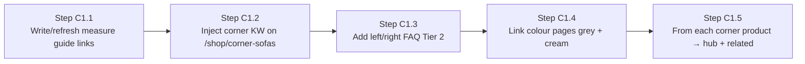

| Layer | Page | Intent | Keywords / action |
|-------|------|--------|-------------------|
| Guide | `/guides/how-to-measure-for-sofa-delivery-uk` | Informational | Link down to corner + U-shape |
| Guide | `/guides/corner-sofa-vs-3-and-2-seater-set` | Investigation | Link to corner hub + 3+2 hub |
| Category | `/shop/corner-sofas` | Commercial | corner sofa, L-shape, small, leather, cheap corner |
| Colour | `/shop/colour/grey-sofas` | Commercial | grey corner sofa |
| Colour | `/shop/colour/cream-sofas` | Commercial | cream / beige corner |
| Products | Lily, Dino, Verona, Ashton, Harrison, Malibu, Oakland, Borrius, Atalian, Olympia, Falcon corners | Transactional | Link up to corner hub |

**Do not put Bishop here** — Bishop is U-shape only.

---

### Cluster 2 — U-shape

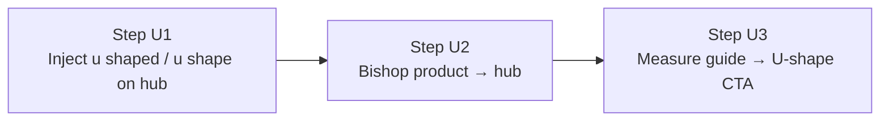

| Layer | Page | Intent | Action |
|-------|------|--------|--------|
| Guide | Measure guide | Informational | CTA to U-shape for large rooms |
| Category | `/shop/u-shape-sofas` | Commercial | u shaped sofa, u shape sofa |
| Product | `/products/bishop-u-shape` | Transactional | Own the U-shape cluster alone |

---

### Cluster 3 — 3+2 sets + Verona comfort

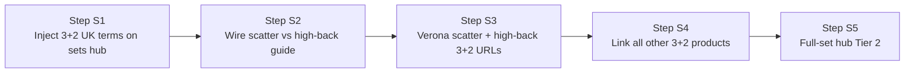

| Layer | Page | Intent | Action |
|-------|------|--------|--------|
| Guide | `/guides/scatter-back-vs-high-back-sofas` | Investigation | → Verona + 3+2 hub |
| Guide | Corner vs 3+2 | Investigation | → both hubs |
| Category | `/shop/3-2-sofa-sets` | Commercial | 3 and 2, sofa 3+2 seater set, etc. |
| Category | `/shop/3-2-1-full-sets` | Commercial | full-set / 3+3-style intent |
| Products | Verona scatter/high 3+2 + Harrison, Ashton, Lily, Dino, Atalian, Olympia, Oakland, Malibu, Falcon | Transactional | Link to sets hub |

---

### Cluster 4 — Chesterfield

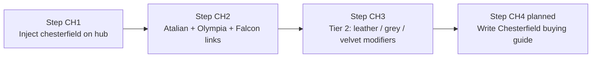

| Layer | Page | Intent | Action |
|-------|------|--------|--------|
| Guide | *planned* `/guides/chesterfield-sofa-buying-guide` | Informational | After Tier 1 hubs done |
| Category | `/shop/chesterfield-sofas` | Commercial | chesterfield sofa(s) |
| Products | **Atalian** (not Italian), Olympia, Falcon | Transactional | Correct Antigravity typo |

---

### Cluster 5 — Modular

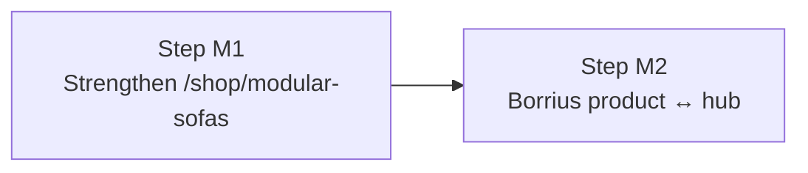

| Layer | Page | Intent | Action |
|-------|------|--------|--------|
| Category | `/shop/modular-sofas` | Commercial | modular sofa (Tier 2) |
| Product | `/products/sloane-borrius-modular` | Transactional | Only modular hero |

---

### Cluster 6 — Size

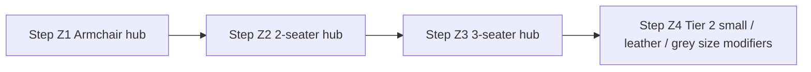

| Category | Keywords | Products |
|----------|----------|----------|
| `/shop/size/armchair` | armchair | Verona, Atalian, Lily, Dino, Olympia, Ashton, Harrison |
| `/shop/size/2-seater` | 2 seater sofa, two seater | All except Bishop |
| `/shop/size/3-seater` | 3 seater sofa, three seater | All except Bishop |

---

### Cluster 7 — Leather

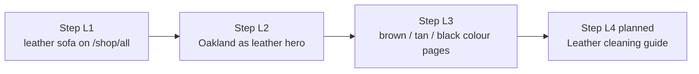

| Layer | Page | Products |
|-------|------|----------|
| Category | `/shop/all` + brown/black colour | Oakland hero; Atalian/Olympia leather options |
| Product | `/products/oakland-sofa` | Tan + black leather / tech leather |

---

### Cluster 8 — Fabric / cord / care

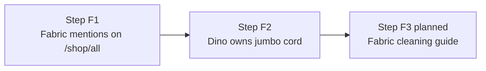

| Layer | Page | Products |
|-------|------|----------|
| Category | `/shop/all` | Ashton, Harrison, Verona, Lily, Malibu, Borrius |
| Product | `/products/dino-sofa` | Jumbo cord / corduroy hero |
| Guide | *planned* cleaning | Tier 3 — after money pages |

---

### Cluster 9 — Colour + COD value

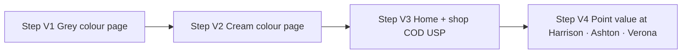

---

## Hold cluster (never inject)

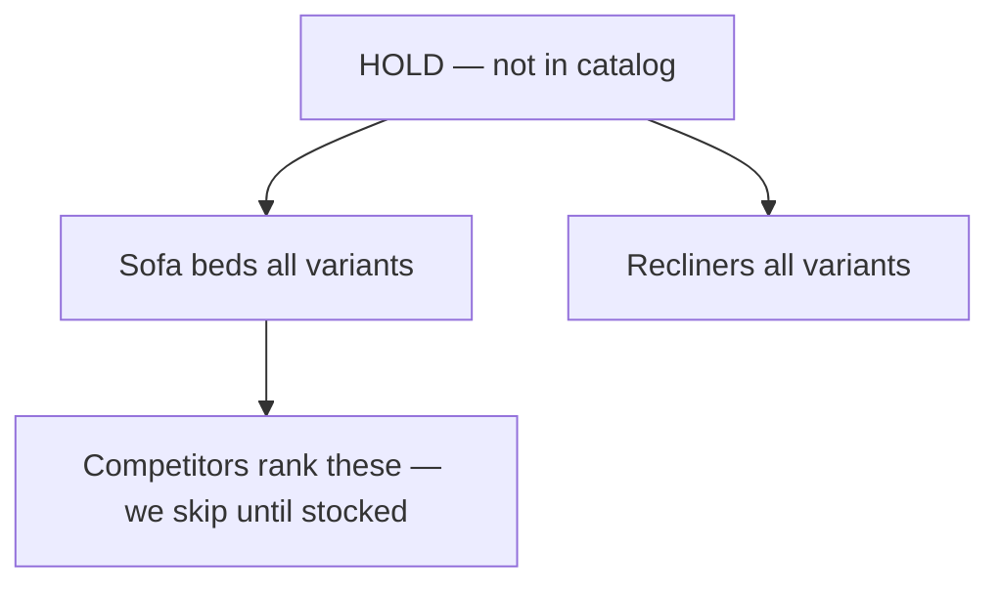

---

## Antigravity diagram — corrections applied

| Antigravity had | Corrected to |
|-----------------|--------------|
| Bishop under Corner | Bishop under **U-shape** only |
| Italian Chesterfield `/products/italian-sofa` | **Atalian** `/products/atalian-sofa` |
| Oakland under Cord & Fabric | Oakland under **Leather** cluster |
| 4 clusters / ~8 products | **9 clusters / all 12 products** |
| Cleaning + Chesterfield guides as live | Marked **planned** until written |

---

## Current products (quick reference)

| Product | Primary clusters |
|---------|------------------|
| Lily | Corner, 3+2, Size, Colour (beige) |
| Dino | Corner, 3+2, Size, Cord/Fabric |
| Verona | Corner, 3+2, Size, Scatter/High back, Colour (grey) |
| Ashton | Corner, 3+2, Size, Value |
| Harrison | Corner, 3+2, Size, Value |
| Malibu | Corner, 3+2, Size, Colour |
| Oakland | Corner, 3+2, **Leather** |
| Borrius | Corner, **Modular** |
| Bishop | **U-shape** only |
| Atalian | Corner, 3+2, **Chesterfield**, Colour |
| Olympia | Corner, 3+2, **Chesterfield** |
| Falcon | Corner, 3+2, **Chesterfield**, Colour (grey) |
